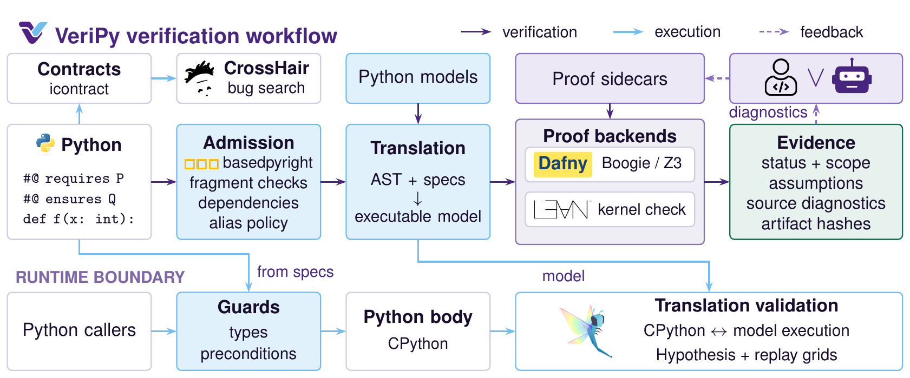

# VeriPy

**Source-Preserving Verification and Compatibility Checking for Python Components**

[Getting started](#getting-started) · [Language guide](https://astrio-labs.github.io/veripy/) · [Documentation](#documentation) ·
[Case studies](case_studies/README.md) · [Citation](#citation)

Keeping a Python implementation and its formal guarantees aligned is a continuing
maintenance problem. A contract must describe the code that callers execute, and
an update must preserve the behavior those callers depend on.

VeriPy is a research tool that connects these obligations. Developers and agents
write contracts, loop invariants and proof hooks directly in Python `#@` comments.
VeriPy preserves admitted executable bodies, encodes them for Dafny or Lean, and
checks auxiliary proofs against the generated obligations. A separate relational
checker establishes whether an updated component still admits old inputs and
preserves returned values and modeled exceptions.

## VeriPy verification workflow



Python code and specifications pass through admission and translation before
Dafny or Lean checks the resulting proof obligations. Humans or agents use
source diagnostics to refine checked proof sidecars. CrossHair searches for
contract violations, while guards and differential execution checks connect the
models to native Python behavior.

Purple arrows show verification dependencies, blue arrows show generation and
execution dependencies, and dashed lavender arrows show proof-assistance
feedback. Generated guards and the generic Hypothesis harness target Dafny.
Case-study replay coverage varies by backend.

## What VeriPy provides

- **Source-level specifications.** Preconditions, postconditions, invariants and
  proof hooks accompany the Python implementation. Checked `.proofs.dfy` and
  `.proofs.lean` files supply backend-specific auxiliary proofs.
- **Agent-assisted proof development.** Source-located diagnostics, a repair
  interface, an embedding API and editor integration support iterative proof
  authoring. The verifier checks the resulting proof support.
- **Compatibility checking.** A product construction compares old and new
  components under explicit input, dependency and observation boundaries.
  Reports distinguish proved compatibility, witnessed differences, unsupported
  inputs and inconclusive runs.
- **Complementary execution checks.** CrossHair searches runtime contracts for
  counterexamples. Hypothesis compares Python execution with compiled Dafny
  models. Generated guards enforce supported runtime conditions.

VeriPy supports selected Python fragments. Backend proofs depend on the frontend
translation and explicit semantic models, whose correctness is not mechanized
end to end. Runtime checks and finite testing provide separate evidence. See the
[supported fragments](docs/SUPPORTED-FRAGMENTS.md) and
[assurance argument](docs/ASSURANCE-ARGUMENT.md) for the precise boundaries.

## Getting started

Use Python 3.11 or newer and install from this repository. The `veripy` package
on PyPI is an unrelated project.

```sh
git clone https://github.com/astrio-labs/veripy.git
cd veripy
python -m venv .venv
source .venv/bin/activate
python -m pip install -e '.[dev]'
```

Follow the [Dafny setup guide](docs/DAFNY.md#setup) to install Dafny 4.11.0 and
make `dafny` available on `PATH`. Then create and verify a small annotated component.

```sh
cat > component.py <<'PYTHON'
#@ ensures result == x + 1
def increment(x: int) -> int:
    return x + 1
PYTHON
veripy check component.py
veripy verify component.py --time-limit 30
```

The CLI uses basedpyright for its static typing gate. Dafny and Lean provide the
proof backends, while native execution checks run in Python. The research proof
cohort uses Python 3.12.2 and Lean 4.33.1. The [Dafny](docs/DAFNY.md) and
[Lean](docs/LEAN.md) guides describe backend setup and supported fragments.

### Check a historical update

Run the maintained Django comparison from the repository root.

```sh
python case_studies/tools/run_compatibility.py \
  --projects django --out build/django-compatibility
```

Use a fresh output directory for each run. The runner checks the old and new
annotated implementations, their proof support and the relation between their
specifications, then compares the verdict with the recorded result. See
[callable compatibility](docs/CALLABLE-COMPATIBILITY.md) to compare your own
components. A failed proof alone does not establish a behavioral difference.

## Research evidence and reproduction

The [case-study index](case_studies/README.md) contains maintained components from
Black, CPython, Django, Packaging, PyPNG, PyTorch, SGLang, python-stdnum, vLLM and
Werkzeug. The studies examine functional proofs, native integration and
compatibility within explicit scopes. They do not establish correctness of
entire repositories or releases.

[Evaluation documentation](docs/EVALUATION.md) describes the protocols and
results, including agent-assisted maintenance trials. Successful and unsuccessful
runs are retained. Comparative proof-reuse benefits and generalization to unseen
upstream changes remain unestablished.

Compact evidence and runnable inputs live in `case_studies/`. Large experiment
records are published in the
[research-2026-09-15 release](https://github.com/astrio-labs/veripy/releases/tag/research-2026-09-15).
The [research archive guide](docs/RESEARCH-ARCHIVES.md) provides checksums,
provenance and reproduction instructions.

For development, run the test suite after installing the development dependencies.
Some integration tests require the external proof toolchains.

```sh
python -m pytest tests
```

See the [test guide](tests/README.md) for subsystem selection and tool requirements.

## Documentation

The [documentation index](docs/README.md) provides a reading guide.

| Topic | Guide |
| --- | --- |
| Architecture and trust boundary | [Architecture](docs/ARCHITECTURE.md), [assurance argument](docs/ASSURANCE-ARGUMENT.md) |
| Writing specifications | [Annotation grammar](docs/SPEC-GRAMMAR.md), [semantics](docs/SEMANTICS.md) |
| Language and backend coverage | [Supported fragments](docs/SUPPORTED-FRAGMENTS.md), [Dafny](docs/DAFNY.md), [Lean](docs/LEAN.md) |
| Comparing versions | [Callable compatibility](docs/CALLABLE-COMPATIBILITY.md) |
| Agents and development tools | [Embedding API](docs/AGENT-INTERFACE.md), [editor integration](docs/EDITOR.md) |
| Research artifacts | [Case studies](case_studies/README.md), [evaluation](docs/EVALUATION.md), [archives](docs/RESEARCH-ARCHIVES.md) |

## Citation

If you use VeriPy in research, please cite the software and record the commit
used in your experiments. Machine-readable metadata is available in
[CITATION.cff](CITATION.cff).

```bibtex
@misc{veripy2026,
  author = {{Naing Oo Lwin} and {VeriPy contributors}},
  title = {{VeriPy}: Source-Preserving Verification and Compatibility Checking for Python Components},
  year = {2026},
  howpublished = {\url{https://github.com/astrio-labs/veripy}},
  note = {Research software, version 0.1.0a1}
}
```

## License

VeriPy is released under the [MIT license](LICENSE). Upstream case-study code
retains its original licenses, included with each project. Workflow image
[provenance and logo attribution](docs/assets/README.md) are recorded separately.
