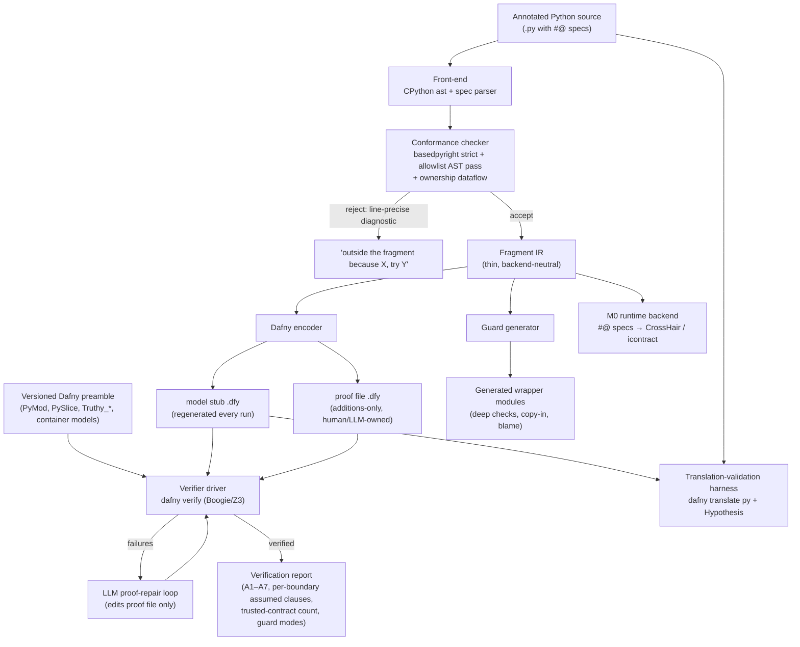

# Architecture

> **Status: planned architecture, M0 built + M1 slices 1–2** (spec parser, runtime backend, conformance survey, basedpyright type gate, clean-bucket Dafny encoder + verifier driver with Python-line failure mapping, translation-validation harness `lemmapy difftest`; the rest is not implemented yet). The first half of this document describes the system we intend to build: components, data flow, and what is trusted vs. validated vs. verified. The numbered sections (§1–§9, "The soundness design") specify the mechanisms those components implement and the argument for why the result can be trusted. The system half will be revised against reality as code lands (see the roadmap); the soundness half is the design's source of truth.

## Pipeline overview

One annotated Python source file flows through the toolchain; nothing is ever hand-edited downstream except the additions-only proof file.



## Components

### Spec parser (`#@` language)

Parses spec comments (`requires`, `ensures`, `invariant`, `decreases`, `mutates`, `extern`, ghost constructs `forall`/`exists`/`old()`/`result`), name-resolves against basedpyright's symbol table for the enclosing scope, and type-checks spec expressions under the same conformance rules as code. Malformed or ill-typed specs are conformance errors, not runtime surprises. Spec expressions reuse the body expression encoder wherever syntax overlaps — one encoder to validate, not two (§6 below).

### Conformance checker

Two passes over files opted in via `#@ verified` (or a manifest):

1. **basedpyright strict** — solves dynamic *typing*; version-pinned and trusted (assumption A7).
2. **Allowlist AST pass** (libcst/`ast` joined with type info) — solves dynamic *semantics*: admits only constructs with a row in the lowering catalog, enforces the escape-hatch/reflection/sealing/import rules, and runs the **ownership dataflow pass** that licenses the value-semantics lowering (rules 1–7 in §3.2 below).

Checker and encoder are held in agreement mechanically: the encoder hard-fails on any construct without a catalog rule, so divergence is a release-blocking bug. Diagnostics are the product surface — every rejection is line-precise with a suggested fix.

### Encoder (Python fragment → Dafny)

Emits **two files per module**:

- a **model stub** (`.dfy`) — translated bodies and contracts, regenerated on every run, never hand-edited;
- an **additions-only proof file** (`.dfy`) — lemmas, asserts, and hints, owned by the human or the agent loop, surviving regeneration.

This split is what makes the regenerate-and-reprove workflow (and agent integration) tractable. The encoder lowers via the catalog (§7 below): clean rules, exactly-right desugarings (`PyFloorDiv`/`PyMod`, slice clamping, truthiness), and Tier 2 curated models from the **versioned preamble** — one auditable file of stdlib models, lemmas, and its own differential test corpus.

Between the front-end and the encoder sits a thin, backend-neutral **fragment IR**. Its only job is to keep the emitter swappable — Dafny is the v1 target; Strata's Laurel is the candidate second target (watchpoints in the roadmap). The IR is not a research artifact and stays as small as possible.

### Guard generator

For each exported island function, the raw verified function becomes module-private (`_f`) and a generated wrapper is the only public surface (§4 below):

- deep structural type check (full traversal, exact types — `type(x) is list`, not `isinstance`);
- executable subset of `#@ requires` run directly; non-executable clauses reported per-boundary as *assumed*;
- copy-in to island-owned representations (discharges the ownership premise against external aliasing);
- blame-carrying `BoundaryContractViolation` errors;
- cost-ladder modes, never silent: check-once-then-own, validated-source tokens, trusted-caller elision, labeled sampling mode;
- island-integrity hardening: frozen/slotted dataclasses, sealed classes, module `__setattr__` traps, `__code__` self-checks.

### Verifier driver and report

Invokes `dafny verify` on stub + proof file + preamble, maps failures back to Python source positions, and emits the **verification report**: per-function verdicts, assumptions A1–A7 verbatim, per-boundary assumed clauses, Tier 3 trusted-contract count ("verified modulo N trusted contracts"), and the guard mode per entry point. The report is the artifact that makes the guarantee honest; a function is "verified" only if the conformance checker and Dafny both pass on the same commit.

### LLM proof-repair loop

When verification fails, an agent reads the driver's structured failure output (failed obligation, source span, counterexample when available) and edits **only the proof file** — adding asserts, lemmas, invariant strengthenings — then re-runs the driver. The loop's interface (machine-readable failures in, additions-only edits out) is a first-class design constraint throughout, not a bolt-on; proof-completion rate without human edits is the headline DX metric. M0's CrossHair counterexamples feed this loop as concrete test cases.

### Translation-validation harness

The encoder is the largest trusted component, so it is validated per-program rather than only argued about (§6 below): Dafny compiles the model back to Python (`dafny translate py`), and Hypothesis — with strategies derived from typed signatures and executable `#@ requires` — differentially tests original vs. compiled model modulo a value adapter (CPython `list`/`dict`/`str` ↔ Dafny `Seq`/`Map`/string). ~200 examples per entry point per PR, coverage-guided runs nightly, counterexamples shrunk and filed as encoder bugs. Executable `ensures` clauses are runtime-checked under test to cover the spec-translation path the body diff cannot see.

### M0 runtime backend

The same `#@` specs compile to CrossHair/icontract runtime checks, giving counterexample-producing results on real dynamic Python before any prover integration exists. This de-risks the spec surface first and remains a permanent fallback mode for code outside the fragment.

## Trusted computing base

Explicit, in three tiers:

| Tier | Component | Status |
| --- | --- | --- |
| **Trusted** | Dafny → Boogie → Z3 | Battle-tested, unverified; accepted cost of buying automation |
| **Trusted** | basedpyright type judgments (A7), pinned CPython (A4), spec-to-contract translation | Pinned versions; spec path mitigated by runtime-checked `ensures` under test |
| **Trusted** | Tier 2 preamble models, Tier 3 extern contracts | One auditable file + differential corpus; extern contracts counted in the report |
| **Validated** | The encoder | Continuous differential testing against CPython |
| **Verified** | Island code | The point of the exercise |

Deliberately **not built**: a VC generator, an SMT solver, a Python parser or type checker, a deep semantics of Python (v2 research track mechanizes the *fragment* semantics in Lean, which also future-proofs a Lean/Laurel backend).

## Repository layout

Directories marked *(planned)* do not exist yet; the rest are built (M0).

```
lemmapy/
  frontend/        # spec parser, conformance survey, basedpyright type gate; M1 checker & ownership dataflow (planned)
  ir/              # fragment IR, thin (planned)
  backends/
    dafny/         # encoder, preamble/, driver (planned)
    runtime/       # M0: icontract/CrossHair emission
  guards/          # guard generator + runtime support library (planned)
  report/          # verification report generation (planned)
  agent/           # proof-repair loop harness (planned)
  difftest/        # translation-validation harness (planned)
docs/              # this file and friends
examples/          # annotated examples (the real documentation)
tests/
```

---

## The soundness design


The selected design — shallow embedding (optionally lightly hybrid), typed island, Dafny-first, `#@` specs, value semantics — is taken as given here; this document specifies the mechanisms that make the selection sound, and answers the question directly: *Python is very dynamically typed — how will you solve that for a shallow embedding?*

The short answer: dynamic typing decomposes into four distinct threats, and "run Pyright before lowering" addresses only the first. The architecture below assigns each threat an independently checkable mechanism with its own artifact in the toolchain. The result is a precise claim:

> **Verified properties hold for every execution that enters the island through the generated guards with all executable checks passing and all per-boundary *assumed* (non-executable) precondition clauses true — both enumerated per entry point in the verification report — in programs the conformance checker accepts, under assumptions A1–A7, with the encoder continuously cross-checked against CPython.** Sampling mode (§4.4) forfeits this guarantee and is reported as such.

---

## 1. The problem, stated precisely

"Python is dynamically typed" conflates two gaps, and only one of them is solved by gating on a type checker.

**Gap 1 — dynamic typing:** types are unknown statically. Requiring annotations and rejecting `Any`/unannotated code (Pyright/Basedpyright/mypy as front-end) genuinely solves this, with strong precedent (Nagini's front-end is exactly this, §8).

**Gap 2 — dynamic semantics of code that already type-checks.** Three hole classes survive strict-mode acceptance:

### 1.1 Python type checkers are deliberately unsound

All of the following pass `mypy --strict` and Pyright strict:

```python
import json
def total(xs: list[int]) -> int:
    return sum(xs)
total(json.loads(s))          # json.loads -> Any; xs may be anything at runtime

xs = cast(list[int], ["a"])   # cast is a runtime no-op and gospel to the checker

def tag(flags: list[int]) -> str:
    return ",".join(str(x) for x in flags)
tag([True, False])            # bool <: int by spec; returns "True,False", not "1,0"

class EvilList(list):
    def append(self, v): super().append(v + 1)
push_zero(EvilList())         # nominal subtyping admits it; verified `ensures` is false
```

Additional holes: `# type: ignore` / `# pyright: ignore`, TypedDict width subtyping (extra keys observable via `len`/iteration), Protocols certifying names but not behavior, and third-party stubs that are unverified claims. Checker acceptance is a *membership* test, not a soundness guarantee.

### 1.2 CPython never enforces annotations

Annotations are metadata. Any untyped caller can invoke a verified function with arbitrary values; `unittest.mock.patch` — standard test practice, so the project's own test suite is the likeliest offender — can rebind island functions at runtime. Consequence: runtime contracts at the boundary are not an optional adoption aid. Without them, every verified guarantee is vacuous exactly when dynamic code calls in.

### 1.3 Typed ≠ semantically aligned with the Dafny model

Mismatches between two *identically typed* programs:

| Area | Python | Naive Dafny model | Divergence |
| --- | --- | --- | --- |
| `//`, `%` | floor division; remainder takes divisor's sign | `/`, `%` are Euclidean; remainder non-negative | `7 // -2 == -4`, `7 % -2 == -1` vs Dafny `-3`, `1` |
| `float` | IEEE-754 binary64: NaN, ±inf, rounding | `real` (exact) | model "proves" `0.1 + 0.2 == 0.3` and totality of `<=` |
| `and`/`or` | return an *operand* | boolean connectives | `x or 5` yields `5` when `x == 0`, not only when `x is None` |
| aliasing | `a = b; b.append(1)` mutates both views | functional seq update | `len(a)` proved `1`, actually `2` |
| `dict` | insertion-ordered, order observable | `map` unordered | any order-dependent result mis-verified |
| `str` | code points incl. lone surrogates | `seq<char>` scalar values | representation edge cases |

The aliasing row is the strongest surviving form of the objection: even a perfectly sound type system would not license the value-semantics lowering, because Pyright/mypy carry **zero** ownership information — aliasing is exactly as legal in typed Python as in untyped Python. It needs its own static discipline (§3.2).

---

## 2. Architecture overview

| # | Obligation | Question it answers | Mechanism | Artifact |
| - | --- | --- | --- | --- |
| 1 | **Static closure** | Is every accepted construct one with a defined Dafny image? | Conformance checker: basedpyright strict + AST lint + ownership dataflow | `verifier check` CI gate |
| 2 | **Entry soundness** | Do the proof's assumptions hold when untyped code calls in? | Generated boundary guards: deep exact-type checks, executable preconditions, copy-in, blame | generated wrapper modules |
| 3 | **Definition integrity** | Is the code that runs the code that was verified? | Runtime hardening + explicit assumptions A1–A7 | assumption list in report & paper |
| 4 | **Model fidelity** | Does the Dafny model mean what the Python means? | Differential testing via Dafny's Python backend + fragment semantics note | CI fuzz harness, encoder bug tracker |

A file is "verified" only if the conformance checker (which includes basedpyright strict as its first pass) and Dafny both pass on the same commit, and its public surface is reachable only through generated guards.

---

## 3. Layer 1 — Fragment conformance checker

Stock Pyright verifies annotations; it does not exclude the dynamism that breaks a shallow embedding (`IslandClass.method = evil`, `setattr(obj, name, v)`, `cast`, `EvilList` all type-check). The front-end is therefore two passes: basedpyright in strict mode (with `reportAny`/`reportExplicitAny` etc. enabled), then an AST-level pass (libcst/`ast` joined with the checker's type info) over files opted in via a `#@ verified` pragma or manifest.

### 3.1 Conformance checklist

Admission is **allowlist-based**: the checker accepts only AST node types and call targets that have a row in the lowering catalog (§7); the forbid-lists below are diagnostics for common near-misses, not the definition of the fragment. (Blocklists over Python dynamism leak — `object.__setattr__`, `operator.setitem`, unbound-method calls like `list.append(x, v)`, three-argument `type()`; none of these need naming under allowlist admission because none has a catalog row.) Checker and encoder are held in agreement mechanically: the encoder hard-fails on any construct without a catalog rule, so a program that lowers without checker acceptance (or vice versa) is a release-blocking bug, and the differential fuzzer (§6) doubles as a probe for constructs the pair mishandles.

- **Escape hatches:** forbid `typing.cast`, `# type: ignore`, `# pyright: ignore`, `TYPE_CHECKING`-conditional divergence, isinstance-laundering of `Any`.
- **Reflection / dynamism:** forbid `eval`, `exec`, `compile`, `getattr`/`setattr`/`delattr`/`hasattr` (even with literal names — the model has no attribute-by-string operation), `globals()`, `locals()`, `vars()`, `__dict__`, `__class__` assignment, `__getattr__`/`__setattr__`/`__getattribute__` overrides, non-default metaclasses, `importlib`, `sys.modules`, `ctypes`, frame introspection.
- **Attributes / monkey-patching:** attribute assignment only on `self` in `__init__`, only for names declared in the class body; require `slots=True`; forbid assignment to attributes of classes, modules, or functions anywhere in the island.
- **Sealing:** island classes are `@final` (or an explicit sealed hierarchy lowered to a Dafny datatype); no method overriding in v1; no user-defined dunders (`__eq__`/`__hash__`/`__bool__`/arithmetic).
- **Imports:** three-tier model (§3.3); forbid `from x import *`; forbid importing anything typed `Any`/`Unknown`.
- **Builtin surface:** an explicit allowlist of modeled builtins and methods (`len`, `range`, `enumerate`, `sorted`, `min`/`max`, `sum`, `abs`, list/dict/set/tuple/str methods with catalog entries, a `math` subset). Any other call is an error, not a warning.
- **Semantic traps:** forbid `float` (v1, §7.2), `is` except against `None`/`True`/`False`, `id`/object `hash`, mutable default arguments, `global`/`nonlocal` writes, `yield`/`async` (v1), non-allowlisted decorators (a decorator replaces the function object — the verified body would not be what runs), bare `except`, heterogeneous `==` operands (closes `1 == True`).
- **Aliasing / ownership:** the rules in §3.2, enforced by an intraprocedural dataflow pass.

### 3.2 Ownership rules for the value model

The value/seq lowering (`xs.append(v)` → `xs := xs + [v]`) is sound iff no mutation is observable through a second reference. Types cannot ensure this; the following flow discipline can, and is checkable intraprocedurally:

1. **Partition** types into value types (`int`, `bool`, `str`, tuples of values, frozen dataclasses — immutable in Python, so the value model is exact) and container types (`list`, `dict`, `set`, mutable dataclasses).
2. **Ownership by provenance:** a container variable is *owned* iff it comes from a fresh allocation — literal, constructor, comprehension, slice copy `xs[:]`, or a call whose contract declares a fresh result. Only owned variables may be mutated.
3. **Borrows:** `ys = xs` and argument passing create borrows; mutation of either name while both are live is rejected (escape hatch: explicit copy).
4. **Callee mutation is declared:** a callee mutating a parameter writes `#@ mutates xs`; the call lowers functionally — callee consumes and returns the seq, caller rebinds (`f(xs)` → `xs := F(xs)`), which also keeps the Dafny side pure-method-friendly.
5. **No mutation through container reads:** `row = grid[0]; row.append(v)` mutates `grid` in CPython but not in the seq model — rejected; the direct form is lowered as a nested update `grid := grid[0 := grid[0] + [v]]`.
6. **Store consumes the name (affine transfer):** after `grid.append(row)` — or use of `row` in a container literal or constructor — *any* subsequent use of `row` (mutation, read, re-store, argument passing) is rejected; a name may be stored at most once. Affine consumption, not a mutation freeze: a mere freeze would admit `grid.append(row); grid.append(row)`, whose nested-update lowering diverges from CPython's shared-reference reality.
7. **Call-site disjointness:** container arguments at any call must come from pairwise-distinct alias groups (as tracked by rule 3), and container-read expressions (`grid[0]`) are rejected in argument position when the callee mutates any parameter — callees are verified under a parameter-disjointness premise that these caller-side checks discharge. For external callers, per-argument copy-in at the guard (§4.1) discharges it: an external `f(xs, xs)` receives two distinct fresh copies.

Plus: no mutation of a container being iterated (CPython's index-based iterator silently skips; reject rather than model).

These rules define the documented fragment ("no observable aliased mutation"); under them the value lowering is *intended* to agree with CPython — the simulation argument in the fragment semantics note (§6) is the artifact backing that claim, and the differential harness checks it continuously. "By construction" is precisely what we do not assume of the encoder. Designing and evaluating this discipline — including its soundness argument — is a research deliverable of the project, not an implementation detail.

### 3.3 Import trust tiers

- **Tier 1 — verified → verified:** cross-module calls lower to Dafny module imports with the callee's translated contract.
- **Tier 2 — curated stdlib:** the allowlist, backed by hand-written Dafny models in one versioned preamble file with lemmas and a differential test corpus — every axiom auditable in one place (this is the answer to the "axiom creep" tradeoff).
- **Tier 3 — typed-but-unverified code:** calls admitted only with an explicit `#@ extern requires/ensures` contract; lowered to a trusted stub; the function's result is reported as "verified modulo N trusted contracts"; each contract optionally compiled to a runtime check so the trust is at least tested. A type annotation is **not** a contract: `-> int` from an unverified module yields havoc-with-type-shape, never purity or determinism; effects default to worst-case.

Untyped modules are unreachable from verified code except through Tier 3 declarations.

### 3.4 Diagnostics are the product surface

RPython's and Numba's histories say a subset tool's perceived quality is mostly the quality of its rejections. Every rule above must fire with a line-precise "outside the fragment because X, try Y" message; an exclusion the checker fails to detect (e.g., silently treating aliased mutation as a value update) is not a scope decision but a soundness bug. Telemetry on which rules fire on real typed corpora prioritizes what v1.5 admits next.

---

## 4. Layer 2 — Generated boundary guards

The translator makes the raw verified function module-private (`_f`) and exports only a generated wrapper.

### 4.1 Guard anatomy

1. **Deep structural type check** against the annotated types — full traversal (typeguard's `ALL_ITEMS` strategy; note that library's *default* checks only the first item of each collection), never first-item or O(1)-sampled checks; verification soundness needs totality.
2. **Executable preconditions:** the executable subset of `#@ requires` runs directly (quantifiers over concrete containers evaluate); genuinely non-executable clauses are reported per-boundary as *assumed, not checked*, so residual trust is visible in the verification report.
3. **Copy-in:** checked data is converted to island-owned representations (frozen structures or fresh lists). This is not polish — type checks alone do not deliver alias-freedom: an untyped caller can retain a reference and mutate it from a callback mid-execution. Defensive copy discharges the ownership premise of §3.2 against the outside world.

Guarded public entry points are **functional-only in v1**: `#@ mutates` is rejected on exported functions — external callers receive results, never in-place effects; island-internal mutating calls use §3.2 rule 4. Copy-out is deliberately excluded: it would reintroduce the caller-side aliasing that copy-in exists to close.

### 4.2 Exact-type policy

- Builtin containers: require `type(x) is list` (etc.), **not** `isinstance` — a subclass overriding `append`/`__setitem__` breaks the seq/map model (and if boundaries ever accepted abstract types like `Sequence`, `isinstance` would additionally be foolable via `ABC.register`). This is sound because CPython builtins cannot be monkey-patched (`list.append = ...` raises `TypeError`).
- `bool` is **rejected** where `int` is expected: the encoder types the two sorts disjointly, and the implemented guards enforce `type(x) is int` exactness — accepting `True` would run the island under a value sort the proof never modeled. (Earlier drafts planned a §7.3 coercion here; exactness won: simpler to defend, and a caller can write `int(flag)`.) NumPy scalars are likewise rejected.
- Island classes: exact `@final` class.
- Protocols / duck typing: not accepted at the boundary in v1.

### 4.3 Blame

Failures raise `BoundaryContractViolation(entry_point, path='users[3].email', expected, actual, caller_frame)`. Entry failures blame the external caller (the blame-theorem shape: well-typed islands can't be blamed). An optional postcondition check at exit blames the toolchain — a live translation-validation alarm feeding Layer 4.

### 4.4 Cost ladder (per boundary, recorded in the report)

Deep check + copy is O(size) per crossing — unacceptable for a hot O(1) entry point. Fallbacks, never silent:

1. **Check-once-then-own:** fuse check and copy into one traversal; amortize by keeping data inside the island across calls (batch APIs over chatty per-element calls). The preferred fix is API shape, not weaker checking.
2. **Validated-source tokens:** validate at the parse edge (pydantic-style), wrap in a private frozen type constructible only by the generated validator; boundaries accept the wrapper with an O(1) token check. The validator must convert payloads to deeply immutable representations (tuples/frozen structures) at the parse edge — a frozen wrapper over caller-held *mutable* data would reintroduce the time-of-check/time-of-use hole that copy-in exists to close.
3. **Trusted-caller elision:** island-to-island calls route to the unguarded `_f` — free, always on.
4. **Sampling mode** (beartype-style spot checks) as an explicitly labeled degraded mode: the report downgrades from "boundary checked" to "boundary spot-checked".
5. Lazy checking proxies: deferred past v1 (bad interactions with mutation and blame timing).

Design boundaries to be coarse and rarely crossed (module/API-level, not per-helper) — the Typed Racket performance lesson (§8).

### 4.5 The gradual-verification guarantee

This layer upgrades "we reject dynamic code" to "we soundly coexist with it," in the shape of gradual verification (Bader–Aldrich–Tanter): **if every boundary check passes at runtime, the statically verified properties hold.** Per assumption class, the report states what is enforced deeply, what is spot-checked, and what is assumed — so "what does the verified island actually guarantee when called from untyped code?" always has a concrete answer. This guarantee is the project's *target theorem*, not an achieved result: v1 states it precisely and enforces it empirically (guards + differential testing); proving it over the fragment semantics note for the v1 fragment is a research-track deliverable (§10).

---

## 5. Layer 3 — Island integrity

Even with a perfect checker and guards, CPython gives outside code write access to almost everything: rebinding `island.f` or `IslandClass.method` (including `mock.patch` leaking into production), rebinding module globals so island-internal call sites resolve elsewhere, runtime subclassing (`@final` is static-only), instance `__dict__` injection, patching `builtins`, `ctypes` memory writes, concurrent mutation from other threads.

**Mitigations that work:**

- `@dataclass(frozen=True, slots=True)` on island data — blocks field mutation and attribute injection. (The exact exception raised for attribute injection varies by CPython version — a reason blame tooling matches on outcome, not exception type; ties into A4.)
- `__init_subclass__` raising `TypeError` — seals classes at runtime to match static `@final`.
- Replace the island module in `sys.modules` with a `ModuleType` subclass whose `__setattr__` raises.
- Bind island-internal cross-references at definition time (closure or default-arg binding) so rebinding module globals cannot redirect internal call sites.
- Cheap integrity self-check at guarded entry: `f.__code__ is original` captured at import, plus a hash of class layout.
- PEP 578 audit hooks logging `import`/`ctypes` events in hardened deployments.

**What cannot be defended is stated, Nagini-style, as explicit proof assumptions:**

- **A1.** Island definitions and the builtins they reference are as verified: no patching of `builtins`, no `ctypes`/`gc`/frame manipulation.
- **A2.** All external entries pass through generated guards (no imports of `_`-prefixed internals).
- **A3.** No concurrent mutation of island-reachable data during island execution. (Largely discharged by the architecture: copy-in gives the island private fresh containers and island data is frozen/slotted; the residual assumption covers Tier 3 extern calls and the guard's own traversal window.)
- **A4.** A pinned CPython version range implements the modeled builtins per the fragment semantics.
- **A5.** Asynchronous exceptions and resource exhaustion (`KeyboardInterrupt`, `MemoryError`, `RecursionError`) are outside the model: properties are partial correctness modulo them. (A Dafny-proven-terminating recursion can still hit the recursion limit; the encoder prefers iterative lowerings and can emit depth preconditions.)
- **A6.** No import-system or encoding-level tampering (`sys.modules` replacement, path hooks).
- **A7.** The pinned basedpyright version's type judgments on accepted files are correct: the type checker is in the trusted base, version-pinned like CPython (A4). Where the AST pass needs a type the checker reports as a mixed value/container union or `Unknown`, the construct is rejected with a narrowing fixit — the pass never guesses, and disagreement between the passes is a hard error, not a precedence question.

These seven lines appear verbatim in the tool's verification report and in any paper.

---

## 6. Layer 4 — Translation validation

The encoder is the largest trusted component; validate it per program instead of only arguing about it.

**Differential loop.** Dafny compiles to Python (`dafny translate py`). So: Python island → Dafny model → Dafny-compiled Python, then differentially test original vs compiled model:

- Hypothesis strategies derived from typed signatures (`st.from_type`), refined by strategies compiled from executable `#@ requires` clauses (`hypothesis.assume` for the residue).
- A value adapter across the representation bijection (CPython `list`/`dict`/`str` ↔ Dafny runtime `Seq`/`Map`/string) — the adapter is itself a precise, testable spec of the type encoding.
- Compare results modulo the bijection, and agreement on raised-exception class where modeled.
- ~200 examples per entry point on every PR; coverage-guided deep runs nightly; counterexamples shrunk and filed as encoder bugs.

This catches exactly the class of bugs shallow embeddings are prone to — the canonical member being division (§7.1): a homophonic lowering of `//` to Dafny `/` verifies the wrong function, and only a cross-execution test or a very careful reviewer notices.

**Spec pipeline.** `#@` expressions live in comments, so the type checker never sees them: the spec parser parses them, name-resolves against basedpyright's symbol table for the enclosing scope, and type-checks them under the same conformance rules plus ghost constructs (`forall`/`exists`, `old()`, `result`); malformed or ill-typed specs are conformance errors, not runtime surprises. The spec translation into Dafny contracts is a trusted component the body-differential loop does *not* cover — original and compiled bodies agree even if an `ensures` was mistranslated. Mitigations: executable `ensures` clauses are runtime-checked at exit under test (the §4.3 alarm), spec expressions reuse the same expression encoder as bodies wherever syntax overlaps (one encoder to validate, not two), and the semantics note below covers spec expressions explicitly.

**Fragment semantics note.** A short big-step semantics for the fragment (expressions, statements, the allowlisted builtins — a few pages) and a simulation statement relating it to the Dafny encoding, argued on paper for representative constructs; optionally mechanized in Lean later, which also future-proofs the shared-IR/Lean-backend option. The note pins down what "faithful" means; the differential tests enforce it continuously.

---

## 7. Lowering catalog (condensed)

Four honest buckets. Every row is either a differential-testable lowering rule or a detected, explained rejection.

| Bucket | Contents |
| --- | --- |
| **Clean** | unbounded `int` (`bool` a disjoint sort — no coercion), `Optional[T]` → `Option<T>` datatype with narrowing replayed as VCs, tuples & multiple returns & swap, frozen dataclasses → datatypes (`replace` → `.(f := v)`), `while`/`for` over `range`/seq with `#@ invariant`/`decreases` passed through, `break`/`continue`, `match` via pattern-compilation to if-chains (silent fall-through modeled; opt-in `#@ exhaustive`) |
| **Desugared — must be exactly right, fuzz targets** | `//`/`%` (§7.1), negative indexing & slice clamping (`PyIndex`, `PySlice` with bounds VCs), truthiness & `and`/`or` (§7.3), comprehensions → loop desugaring into fresh accumulators (+ characterizing postconditions); eagerly consumed genexps → logic (`all` → `forall`, `any` → `exists`, `sum` → fold), chained comparisons, unpacking with arity VCs |
| **Curated models (Tier 2 preamble)** | str as `seq<char>` of Unicode scalar values — strings containing lone surrogates are rejected at the guard, aligning the model's char domain with the accepted value domain; str methods (`split`/`strip`/`find`/`join`…; Unicode-table methods ASCII-only or axiom-flagged), `sorted` (permutation + order; stability only on demand), `dict`/`set` ops (keys restricted to hashable value types, homogeneous), `math` subset, `str(int)`/`int(str)` with parse VCs |
| **Excluded in v1 — detected, with reasons** | `float` (§7.2), generators/custom iterators (§7.5), `try/except` (v1 proves absence instead, §7.4), inheritance & user dunders (dispatch is value-dependent; C3 over mutable class objects; behavioral subtyping is the principled v2 via traits), `async` (await points break local reasoning; "sequentializable async" noted as v2 candidate), decorators (function surgery), `nonlocal`, dict iteration where order is observable (offer `sorted(d)`) |

### 7.1 Integer division and modulo

Python `//`/`%` are floor-based (remainder takes the divisor's sign); Dafny's `/`/`%` are Euclidean (remainder in `[0, |b|)`). They coincide for `b > 0` and diverge exactly when `b < 0` and `b ∤ a`: Python `7 // -2 == -4`, `7 % -2 == -1`; Dafny `7 / -2 == -3`, `7 % -2 == 1`. Preamble:

```dafny
function PyMod(a: int, b: int): int
  requires b != 0
{
  var r := a % b;                    // Euclidean: 0 <= r < |b|
  if b < 0 && r != 0 then r + b else r
}

function PyFloorDiv(a: int, b: int): int
  requires b != 0
{
  (a - PyMod(a, b)) / b              // exact division, so Euclidean / is safe
}
```

Ship proved lemmas (`PyFloorDiv(a,b)*b + PyMod(a,b) == a`; sign-range lemmas for each sign of `b`) so SMT automation doesn't die on user code. Every site emits the `b != 0` VC. When a range analysis proves `b > 0` (the common case: `i % 2`, `x // 10`), lower directly to Dafny `/`/`%` so existing lemmas and triggers fire. `int / int` (true division returns `float`) is rejected with a fixit suggesting `//`.

### 7.2 Floats: excluded in v1, with the precise reason

Every candidate model fails: (1) `real` is *unsound*, not merely imprecise — it proves associativity and totality of `<=`, both false for IEEE (NaN also breaks the reflexivity of `==` that every seq/set lemma assumes); (2) bit-precise FP is not exposed by Dafny, and FP theories crater SMT automation — forfeiting the LLM-proofability thesis; (3) uninterpreted-type axioms can state almost nothing useful. Later: an explicit per-function `#@ assume idealized-reals` flag lowering to `real`, always surfaced as a soundness caveat in the report, never claiming NaN/inf behavior.

### 7.3 Truthiness, `and`/`or`, and the bool/int coercion

`and`/`or` on bool operands lower to `&&`/`||` — short-circuiting is load-bearing for well-definedness (`i < len(xs) and xs[i] > 0` must guard the bounds VC). For non-bool operands, truthiness is statically resolvable per type — define `Truthy_T`: bool ↦ `b`; int ↦ `x != 0`; str/list/tuple/dict/set ↦ `|x| != 0`; `Option<T>` ↦ `x.Some? && Truthy(x.value)` (matches CPython, and makes the classic `Optional[int]`-vs-`0` bug visible to the prover); frozen dataclass ↦ `true`. Then `x or y` ⇒ `var t := x; if Truthy_T(t) then t else y` (single evaluation), dually for `and`; non-bool conditions wrap in `Truthy_T`. Where the checker types a value at an int-position as `bool`, the encoder emits `(if b then 1 else 0)` (PEP 285 makes `[True, False] : list[int]` legal; Dafny's `bool`/`int` are disjoint).

### 7.4 Exceptions: absence first, outcomes later

**v1:** implicit exceptions become verification conditions proving absence — exactly the safety VCs the lowerings already emit (`xs[i]` ⇒ bounds; `d[k]` ⇒ `k in d`; `//` ⇒ `b != 0`; `range` step ⇒ `!= 0`; `int(s)` ⇒ parse precondition). `raise` admitted only where provably unreachable; `try/except` rejected. Headline v1 guarantee: *this function raises nothing* — with zero signature pollution.

**v1.5:** intentionally raising functions lower to a failure-compatible `Outcome<T> = Ok(value) | Err(e: Exn)` datatype; calls lower to Dafny's `:-` elephant operator, giving propagation for free; `except E` matches against an explicit finite hierarchy; `finally` restricted (duplicated on both paths; rejected if it contains `return`/`raise`/`break` — CPython's swallow-the-exception footgun is cheaper to reject than model); bare `except`/`BaseException` excluded (they would claim to catch failures outside the model).

### 7.5 Generators: excluded, with the precise reason

A `yield` function is a coroutine: locals and program counter persist across suspensions, and meaning is defined only against an interleaved consumer. A shallow lowering would need frame reification, a state-machine transform, a spec language for inter-yield invariants (about compiler-generated state the user never sees — destroying the annotate-real-Python DX), and non-compositional termination of the producer/consumer pair. That is verified-coroutines research, not a v1 rule. The carve-outs that keep idiomatic code inside: genexps consumed eagerly by `all`/`any`/`sum`/`min`/`max`/`len`/`list`/`sorted` (lowered to logic/folds) and direct `for` over lists/ranges/dicts (never materialized as iterators in the model). This covers the dominant share of generator uses in typed application code; the rest is rejected-with-reason.

### 7.6 Closures and higher-order functions

Pure lambdas lower to Dafny function values; curated HOF models carry the right contracts (`sorted` key: permutation + ordered-by-key). The semantic gap is capture: Python captures by reference with late binding (`[lambda: i for i in range(3)]` — all return `2`); Dafny lambdas capture values. Rule: capture only variables never assigned after the capture point (same dataflow pass as ownership); loop-variable capture is rejected with the `lambda x, i=i:` fixit, which is then accepted (by-value capture). `nonlocal` writes rejected; bound methods, `functools.partial`, decorator-transformers excluded (runtime function surgery the model cannot see).

---

## 8. Precedents

The architecture is citable, not speculative:

| System | What it demonstrates | Lesson taken |
| --- | --- | --- |
| **Nagini** (Eilers & Müller, CAV 2018; Viper) | The exact front-end shape, published: require PEP 484 annotations, run mypy, reject on error, shallowly encode the typed residue into an IVL | Direct existence proof; copy its practice of stating soundness assumptions explicitly (A1–A7) |
| **mypyc** (compiles mypy, black) | Typed island trusting annotations internally + runtime checks where untyped code crosses in — in production | The boundary-guard pattern ships today; verification needs precondition checks too, not just type tags |
| **Static Python / Cinder** (Meta) | Sound gradual typing enforced at Instagram scale | The boundary is *practical*; enforcement depth (deep vs shallow) is a real per-region design axis |
| **RPython** (PyPy) | Production software written in a disciplined Python subset | Explicit annotations over whole-program inference; rejection diagnostics are the primary UX |
| **Numba** nopython mode | Users accept restrictive subsets when the reward is immediate; per-function opt-in granularity | Budget diagnostics as a v1 deliverable; the reward here is a visible "verified" per function |
| **TorchScript** (maintenance mode) | Owning a bespoke Python front-end leads to subset drift and death | Delegate parsing/typing to CPython AST + Pyright; keep the fragment small, versioned, principled |
| **Typed Racket + blame** (Tobin-Hochstadt & Felleisen; Wadler & Findler) | Typed regions keep guarantees against untyped clients via boundary contracts; blame lands on the untyped side | The formal backbone of §4; Takikawa et al. (POPL 2016) warns: make boundaries coarse and rarely crossed |
| **Reticulated Python** (Vitousek et al.) | Transient tag-level checks are sound-ish but shallow | Tag checks cannot discharge deep preconditions — specify enforcement depth per assumption class (§4.5) |
| **Gradual verification** (Bader, Aldrich, Tanter, VMCAI 2018) | The theorem shape for statics+dynamics | "Checks pass ⇒ verified properties hold" is the claim to defend; SMT-backed gradual verification for Python is open novelty |
| **CrossHair / icontract / deal / beartype / typeguard** | The dynamic side's ecosystem exists | Emit boundary contracts into existing formats; CrossHair doubles as a spec-counterexample oracle (M0) |
| **Dafny → Python backend** (used in production by AWS-verified libraries) | The model is executable | The differential-testing loop of §6 |

**Delta over precedent.** The composition, not the pieces, is the contribution: (1) an ownership discipline sufficient for a value-semantics lowering of typed Python, with a soundness argument — trading Viper-style permissions for SMT/LLM automation (Nagini has the typed front-end but pays the permission-logic cost in spec burden and automation); (2) a gradual-verification boundary with blame and *semantic* (not tag-level) contracts for a real dynamic language — open territory per the VMCAI line; (3) continuous translation validation of the encoder via the backend's own Python compiler; (4) an evaluation of LLM proof completion against this pipeline. No precedent system has (2), (3), or (4); together they are the thesis, with Nagini as the baseline that proves the front-end shape and lacks the automation/DX properties they serve.

Framing worth keeping: dynamic typing is a property of the *language*; verification targets *programs*. Under the LLM-greenfield thesis the fragment is a *generation target*, not just a filter on found code.

---

## 9. What is and is not claimed

**Claimed:** for programs accepted by the conformance checker, properties verified by Dafny hold of every execution entering through generated guards with all executable checks passing and any per-boundary assumed (non-executable) clauses true — both enumerated in the verification report — under A1–A7, with the encoder differential-tested against CPython on every change.

**Not claimed:** full CPython semantics; anything about `float` behavior (v1); behavior under runtime patching of island definitions, `ctypes`, or concurrent mutation (A1–A3); behavior past asynchronous exceptions or resource exhaustion (A5); correctness of Tier 3 extern contracts (reported as trusted, optionally runtime-checked).

Each "not claimed" is either detected and rejected, guarded, or stated — never silent.

---

*Phasing and milestones for building these mechanisms are tracked in the project roadmap.*
